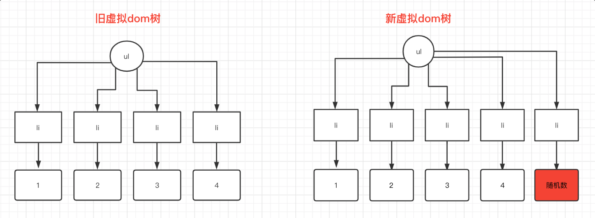
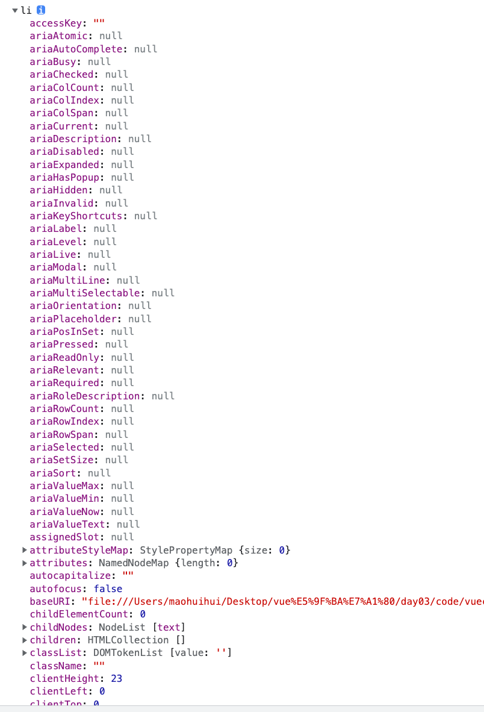
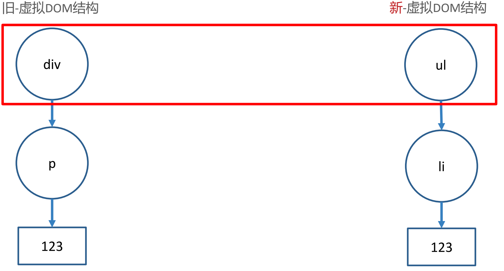
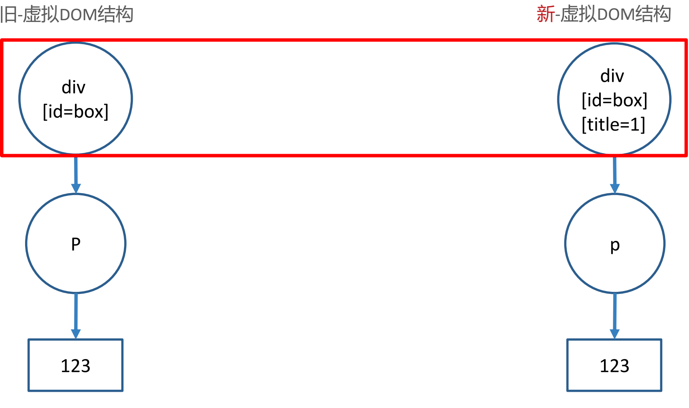
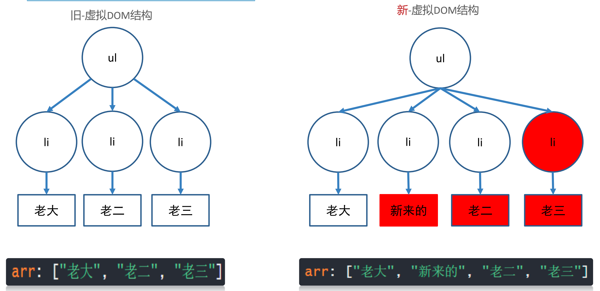
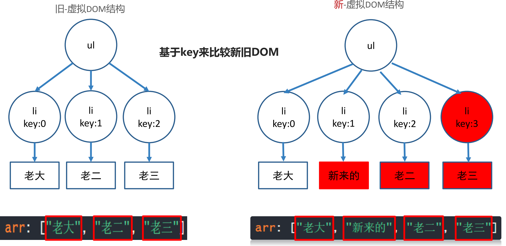
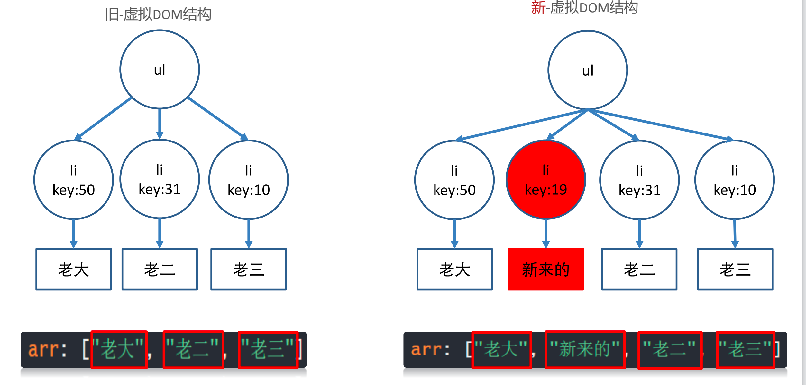
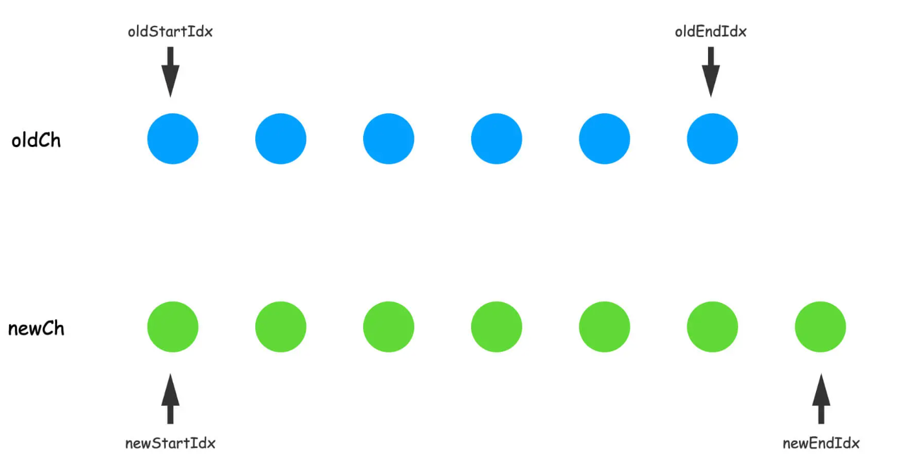
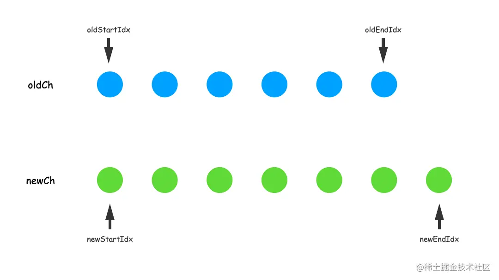

## 什么是虚拟 dom

本质上就是一个 JS 对象，作用：本质是保存节点信息, 属性和内容的一个JS对象。虚拟 dom本质是一个js对象，跨平台也可以复用代码

> **比如 template 里标签结构**

```vue
<template>
  <div id="box">
    <p class="my_p">123</p>
  </div>
</template>

```

> **对应的虚拟 DOM 结构**

```js
const dom = {
  type: 'div',
  attributes: [{ id: 'box' }],
  children: {
    type: 'p',
    attributes: [{ class: 'my_p' }],
    text: '123'
  }
}

```

## vue 是如何利用虚拟dom来更新

- 初次渲染时，会根据 model 数据创建一个虚拟 DOM 对象（树）

  ```js
  data: {
    list: [1, 2, 3, 4]
  }
  ```

  ```html
  <ul>
    <li v-for="item in list">{{ item }}</li>
  </ul>
  
  ```

  ```js
  const dom = {
    type: 'ul',
    attributes: [],
    children: [
      { type: 'li', attributes: [], text: '1' },
      { type: 'li', attributes: [], text: '2' },
      { type: 'li', attributes: [], text: '3' },
      { type: 'li', attributes: [], text: '4' }
    ]
  }
  
  ```

- 根据虚拟 DOM 生成真正的 DOM，渲染到页面

- 当数据变化后，会重新根据新的数据，创建新的虚拟 DOM 对象（树）

  ```js
  data: {
    list: [1, 2, 3, 4, 5]
  }
  
  ```

  ```html
  <ul>
    <li v-for="item in list">{{ item }}</li>
  </ul>
  
  ```

  ```js
      const dom = {
        type: 'ul',
        attributes: [],
        children: [
          { type: 'li', attributes: [], text: '1' },
          { type: 'li', attributes: [], text: '2' },
          { type: 'li', attributes: [], text: '3' },
          { type: 'li', attributes: [], text: '4' },
          { type: 'li', attributes: [], text: '随机数' }
        ]
      }
  
  ```

- 此时有两份虚拟 dom，利用 diff 算法进行两份虚拟 dom 进行对比

​		

> Vue 渲染真实dom的原则 一般都是采用就地复用，只更新 改变了的真实dom

## 为什么需要要采用虚拟dom

提高DOM更新的性能, 不频繁操作真实DOM, 在内存中找到变化部分, 再更新真实DOM(打补丁)

**虚拟dom**

```js
const dom = {
  type: 'li',
  attributes: [],
  text: '1'
}
```

**真实dom**



## diff算法

### 1. 同级比较-根元素变化-整个dom树删除重建



### 2.同级比较-根元素不变-属性改变更新属性



### 3.diff算法中 key的作用

#### **无key**

**最大限度尝试就地修改/复用相同类型元素**



#### 有key, 值为索引

**先产生新旧虚拟DOM, 根据key比较, 还是就地更新**




#### 有key值，唯一不重复的字符串或数字



### 4.UpdateChildren

父元素相同的情况下 ， 子元素 是如何比较的呢？？UpdateChildren的这个方法来实现的

#### UpdateChildren核心思路

- 采用双针比较法




- 首先是`oldStartVnode`和`newStartVnode`进行比较，如果比较相同的话，移动`oldStartIdx`和`newStartIdx`。


- 如果`oldStartVnode`和`newStartVnode`匹配不上的话，接下来就是`oldEndVnode`和`newEndVnode`做比较了。


- 但如果两头比较和两尾比较都不是相同节点的话，这时候就开始交叉比较了。首先是`oldStartVnode`和`newEndVnode`做比较。


- 如果`oldStartVnode`和`newEndVnode`匹配不上的话，就`oldEndVnode`和`newStartVnode`进行比较。

  

此时，如果四种比较方法都匹配不到相同节点的话，我们就只能使用暴力解法去实现了，也就是针对于`newStartVnode`这个节点，我们去遍历`oldCh`中剩余的节点，一一匹配。